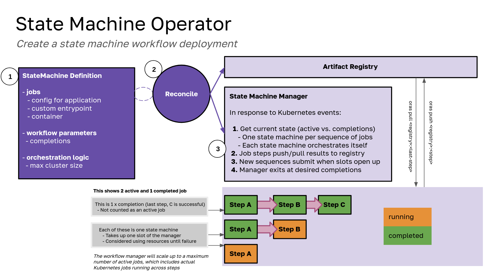

# state-machine-operator

> State machines in Kubernetes 🐦‍🔥



The operator (Kubernetes) part will be added soon! Right now we have the configs that create the state machine and orchestrate the work.

## Usage

### Prerequisites

- go version v1.22.0+
- docker version 17.03+.
- kubectl version v1.11.3+.
- Access to a Kubernetes v1.11.3+ cluster.

### 1. Create Cluster

You can create a cluster locally (if your computer is chonky and can handle it) or use AWS. Here is locally:

```bash
kind create cluster --config ./examples/kind-config.yaml
```

### 2. State Machine Workflows

We provide two examples - one using the operator, and one manual for those that want to create the various objects and understand how the state machine operator (and corresponding Python library) work. For the manual examples, see the readme in [examples](examples). We will continue here with the operator example.

### 3. Install the Operator

The operator is built via its manifest in dist. For development:

```bash
# Install and load into general cluster
make test-deploy-recreate

# Install and load into kind
make test-deploy-kind
```

For non-development:

```bash
kubectl apply -f examples/dist/state-machine-operator.yaml
```

And apply the CRD to create the state machine. For interactive work, remember to set spec->workflow->interactive (or the same for any job under jobs) to true.

```bash
kubectl apply -f examples/state-machine.yaml
```

For the Mummi example (all code is private) see [examples/mummi](examples/mummi).

### Job Variables

For each job script section, the following environment variables are provided for your application:

- jobid: the job identifer, which defaults to `job_` and can be set under the state machine workflow->prefix.
- outpath: defaults to /tmp/out and is where your working directory will be, and where output is expected to be written.
- registry: the registry where your artifact will be pushed
  - pull_tag: the pull tag to use (if the workflow is pulling)
  - push_tag: the push tag to use (if the workflow is pushing)

Take a look at the simple example [examples/state-machine.yaml](examples/state-machine.yaml) to see how push/pull is defined between steps. Given that these are found (with a tag) your artifact will be named `<registry>:<jobid>:<tag>` to be moved between steps.

## Design

These are some design decisions I've made (of course open to discussion):

### Initial Design

 - The workflow model is a state machine - state is derived from Kubernetes, always
 - The state machine manager manages units of job sequences (each a state machine) and each state machine orchestrates the logic of the jobs within it.
 - No application code (the jobs) is tangled with the state machine or manager
 - We assume jobs don't need to be paused / resumed / reclaimed like on HPC
 - Jobs are modular units with a config known how to be parsed by the manager, and the rest is provided to them.

### TODO

- We likely want to test with a real registry OR allow a volume bind (existing data) to the registry.
  - Otherwise, artifacts deleted on cleanup. We could also have an option that allows keeping the ephemeral registry.

### Questions

- Under what conditions do we cancel / cleanup jobs?
- I haven't tested a failure yet (or need to cleanup / delete)
- We might want to do other cleanup (e.g., config maps)

## License

HPCIC DevTools is distributed under the terms of the MIT license.
All new contributions must be made under this license.

See [LICENSE](https://github.com/converged-computing/cloud-select/blob/main/LICENSE),
[COPYRIGHT](https://github.com/converged-computing/cloud-select/blob/main/COPYRIGHT), and
[NOTICE](https://github.com/converged-computing/cloud-select/blob/main/NOTICE) for details.

SPDX-License-Identifier: (MIT)

LLNL-CODE- 842614
